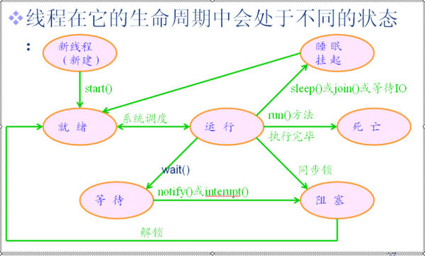

### 熟练服务器编译、打包，能够在服务器独立部署应用程序，熟练使用常用web容器。

- 服务器编译
```
javac Demo.hava -d .
```
- 服务器打包
```
jar -cvfm hello.jar MANIFEST.mf com 打包整个com目录里的class
jar -cvfm hello.jar MANIFEST.mf *.class 打包当前目录里的所有class
（.mf文件后缀固定，但文件名随意，如test.mf也可以）
```
### 了解进程、线程定义，了解系统操作指令，能做多线程编程。
- 什么是进程？ 什么是线程？
```
进程是具有一定独立功能的程序关于某个数据集合上的一次运行活动，进程是系统进行资源分配和调度的一个独立单位。

线程是进程的一个实体,是CPU调度和分派的基本单位，它是比进程更小的能独立运行的基本单位。线程自己基本上不拥有系统资源，只拥有一点在运行中必不可少的资源（如程序计数器，一组寄存器和栈），但是它可与同属一个进程的其他的线程共享进程所拥有的全部资源。
```



### 熟练web容器的配置及调优，改善程序性能。


### 熟练使用系统操作指令、shell编程、vi、系统资源分析命令或工具，能做自动化编程和系统运维、系统调优工作。


#### 熟练配置使用Keepalive、Lvs，并深入理解Keepalive、Lvs原理及其算法（如轮询、随机、权重等），能够合理搭建系统应用的高可用方案，深入理解docker、k8s等虚拟化容器技术。
keepalive原理: (https://www.cnblogs.com/wangjq19920210/p/8440824.html)
```
总结:
TCP的keepalive机制和HTTP的keep-alive机制是说的完全不同的两个东西，tcp的keepalive
是在ESTABLISH状态的时候，双方如何检测连接的可用行。而http的keep-alive说的是如何避
免进行重复的TCP三次握手和四次挥手的环节。
```

- 什么是Docker？

Docker 是一个开源的应用容器引擎，基于 Go 语言 并遵从Apache2.0协议开源。

Docker 可以让开发者打包他们的应用以及依赖包到一个轻量级、可移植的容器中，然后发布到任何流行的 Linux 机器上，也可以实现虚拟化。

容器是完全使用沙箱机制，相互之间不会有任何接口（类似 iPhone 的 app）,更重要的是容器性能开销极低。
