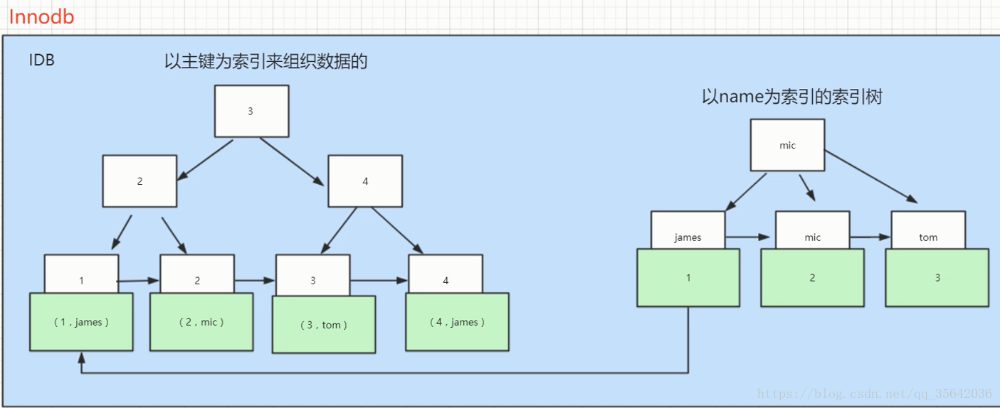
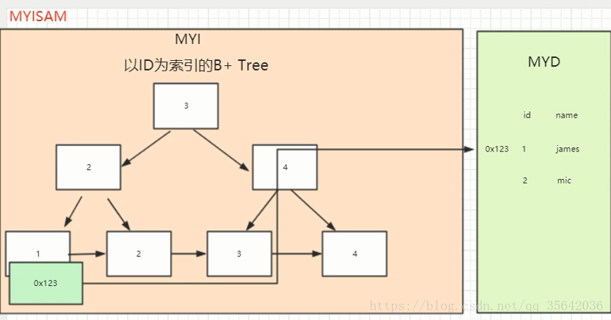

# oracle

## 基础篇

### 存储结构

  
  

  1. 是否要支持事务，如果要请选择innodb，如果不需要可以考虑MyISAM；
 
     2. 如果表中绝大多数都只是读查询，可以考虑MyISAM，如果既有读也有写，请使用InnoDB。
 
     3. 系统奔溃后，MyISAM恢复起来更困难，能否接受；
 
     4. MySQL5.5版本开始Innodb已经成为Mysql的默认引擎(之前是MyISAM)，说明其优势是有目共睹的，如果你不知道用什么，那就用InnoDB，至少不会差

### InnoDB为什么推荐使用自增ID作为主键？

自增ID可以保证每次插入时B+索引是从右边扩展的，可以避免B+树和频繁合并和分裂（对比使用UUID）。如果使用字符串主键和随机主键，会使得数据随机插入，效率比较差。