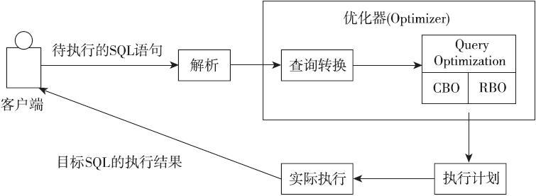

# oracle

## 基础篇

### 优化器
- 什么是优化器？

优化器是数据库最核心的功能，也是最复杂的一部分。它负责将用户提交的SQL语句根据各种判断标准，制定出最优的执行计划，并交由执行器来最终执行。优化器算法的好坏、能力的强弱，直接决定了语句的执行效率。笔者也使用了其他诸如MySQL、PostgreSQL、SQLServer等关系型数据库，综合比较来说，Oracle的优化器是功能最强大的。学习SQL优化，从本质来讲就是学习从优化器的角度如何看待SQL，如何制定出更优的执行计划。当然，优化器本身是数据库系统中最为复杂的一个部分，本书会就优化器的分类、工作原理等做简单介绍，不会深入细节。

成本是优化器（基于成本的优化器）中反映SQL语句执行代价的一个指标。优化器通过比较不同执行计划的成本，选择成本最小的作为最终的执行计划。如何理解成本、成本如何计算也就成为我们学习基于成本的优化器的关键所在。

sql执行过程：

  

- 优化器对比

    RBO和CBO的优缺点
    RBO:基于规则的优化器
    CBO: 基于成本的优化器
  

## 调优篇

### sql调优

 ---

#### 1 . 为什么主键总是数字类型居多？

---
字符类型在索引中是“乱序”的，这是因为字符类型的排序方式与我们的预期不同
适用于 between，但><=情况下会全局扫描。

原因： 在对字符类型使用大于运算符时，会导致优化器认为需要扫描索引大部分数据且聚簇因子很大，最终导致弃用索引扫描而改用全表扫描方式。
#### 2 . 笛卡尔积

一般情况下应尽量避免笛卡儿积，除非某些特殊场合。否则再强大的数据库，也无法处理。

#### 3 .  
统计信息是优化器优化的重要参考依据，一个完整、准确的统计信息是必要条件。往往在优化过程中，第一步就是查看相关对象的统计信息。
·分区机制是Oracle针对大数据的重要解决手段，但其也很容易造成所谓“放大效应”。即对于普通表而言，统计信息更新不及时可能不会导致执行计划偏差过大；但对于分区表、索引来说，很容易出现因更新不及时出现0的情况，进而导致执行计划产生严重偏差。