# postgresql

## 调优篇

### sql调优

 ---
 
### 了解数据库的基本事实：

---
 1 . 数据库中读比写更频繁
 
        在几乎所有的应用程序中，除了在极少数的情况下，一块数据会被读取很多次，而写或改操作仅发生几次。在我们尝试优化查询时，保持这个事实很重要。

 2 . 数据始终在块或页面中读取，而不是作为单独的记录或列
 
       当我们向PostgreSQL数据库请求读取表中的一列（这个表有30列和数以百万计的记录）时，PostgreSQL会取8 KB的块。同样，当我们改变记录中的列值时，PostgreSQL将读取然后写入到一个8 KB的块。如果审视数据库/查询优化技术，我们会意识到，它们中的大多数关注以下2个项目：
       
       ·减少读/写模块的数量。这里的焦点不是物理上的读/写，而是访问的块的数量。
       
       ·减少物理I/O。
       
       这两者一起涵盖了大多数用来降低数据库瓶颈的技术。还有其他的可用方法，如使用高转速的磁盘或使用固态硬盘，同时要尽量减少CPU的利用率。
 3 . 常见的优化方法：
  
  - 索引 ：当对大数据集中的一些记录执行SELECT、UPDATE、DELETE查询，且需要较多时间时，我们针对需要过滤的列创建索引。创建索引可以减少需要扫描的块的数目，从而返回相关的记录。术语SELECTIVITY用来定义检索记录的比例。
  
  |索引类型|适用场景|
  |----|----|
  |B-tree|PostgreSQL中，B-tree索引是最常用的一种索引类型。用索引扫描比顺序扫描速度快，因为它可能只需要读取少部分页面，而顺序扫描可能读取几千个页面。          默认情况下，使用CREATE INDEX语句，会创建一个B-tree索引，这对于大多数常用数据类型比如文本、数字等的适用性很强。|
  |GIN|当数据类型在一列中包含多个值时适用。这种情况下最常见的数据类型是hstore、range、jsonb等，并不是所有的数据类型都支持这种索引类型。|
  |GiST|GiST索引适用的情况是：有一些数据，它们和其他行的同一列中的值在某种程度上相互覆盖，此时适用。最合适的数据类型是：几何类型、全文检索时的文本类型。|
  |SP-GiST|空间分区GiST索引，适用于较大的数据，当数据有自然聚类元素时最适用，典型的例子是电话号码。|
  |BRIN|适用于较大的数据，和SP-GiST类似。当有非常大的数据表，而且按时间、邮政编码排好顺序时，BRIN索引允许快速的跳过或排除很多不需要的数据。|
  |哈希索引|可以提供比B-tree索引更快的查询。但最大的问题是被限制在等值上所以需要寻找准确的匹配。这使得哈希索引不那么灵活。|
  
  
  - 规范化 ：当我们通过规范化的规则将一个臃肿的表拆分到较小的表时，所得的表的列数会下降。作为结果，与原表相比每一个所得到的表占用更少的块。当从这样的新表获取或更新数据时，只需要更少的块被读取。
  - 分区 ：通常，我们需要拆分有非常多记录数的表，把它分成许多小的部分或分区。规范化减少了结果表中的列数，分区可以水平拆分表。当数据通过过滤分区字段被抽取时，优化程序能够计算出数据所在的一个或多个特定的分区，从而能够避免扫描整个表。这使得需要读取的块的数量有明显的下降。分区仅对非常大的表有帮助，而不是针对小表的情况。
 
#### 查询组件 

---
  既然读比写更频繁，那我们就从查询的四个组件入手优化
  
  - 解析器 ：执行SQL字符串的语法和语义检查。
  - 重写器 ：在某些情况下改变查询；例如，如果查询是针对一个视图，重写器将修改查询，使它面向的是基础表而不是视图。
  - 计划器 ：这个关键部件产生执行计划。
  - 执行器 ：该组件执行计划器所产生的计划。
  
#### 计划器是什么，在postgres扮演什么样的角色?

---

计划器的工作是产生执行计划。计划是一棵由一个或多个节点构成的树。每个节点执行并返回零个或多个元组。这些元组被树中的父节点使用，直到这种操作到达根节点，根节点将结果返回给客户端。计划器必须做出一些决定，现在我们将详细讨论。
  
 例子1 ：
       看一个简单的查询：
      
      优化器需要做的关键的决定是如何得到用户想要的数据。它应该这样：
      
      ·从表中取数据，或转到一个索引，并停在这里，因为所有需要的列都在索引里面（仅限PostgreSQL 9.2和更高版本），或获取记录的位置并到表中获取数据
      
      第一个方法直接从表中取数据，称为顺序扫描（Sequential Scan）。这对小表的效果最好。
      
      在第二个选择中，如果不需要访问表，我们就是只扫描索引（Index Only Scan）。
      
      另外，如果在访问索引后需要访问该表，则必须有两个选择。一种是位图索引扫描（位图被创建且代表匹配的元组）。然后，从表中获取记录（也被称为堆）。这是一个两步的过程，逐个顺序执行。第二个是先读取索引，然后连续读取表。这些步骤可以多次重复的执行，直到所有的记录都被获取。
      
      前面的部分只包括一个单表和索引的情景。连接多个表时，情况会是怎么样的？这些表之间可能有INNER JOIN、OUTER JOIN（LEFT、RIGHT或FULL）或CROSS JOIN。在这些情况下，PostgreSQL已经决定加入策略。
      
      关键词INNER和OUTER是可选的。PostgreSQL默认是INNER。如果我们指定了LEFT、RIGHT或FULL，OUTER连接就会被自动应用。
 #### 计划器中的连接策略：
  
  连接策略指的是如何连接表。可能的策略如下：
  
  嵌套循环的方法，使用该方法时，表中的每一个记录被取出，然后产生一个与其他表中的每一记录相比较的循环。如果有一次匹配，那么记录即输出：
 
 ·对于每个外部元组
  
  ·对于每个内部元组
  
  ·如果连接条件满足
  
  ·输出结果行
  
  在此方法中，成本与各表中的记录数的乘积成比例。
  
  另一个连接策略是先从两个表中排序数据集，然后扫描排序集，当匹配出现时，完成值的匹配并返回记录。这就是所谓的排序合并连接（sort-merge join）。
  
  第三个选择被称为散列连接，它被用于等值连接。在这种方法中，一张表的每一行用散列算法创建一个散列表。通常，这种操作是对小表。然后，其他表的每一行也被散列化，这时候创建后的散列表被执行一次扫描，以寻找一个匹配。
  
  除了前面的决策，还有关于排序、聚合或使数据流水线化的决策。我们可以展示出计划中节点和决策的重要类别，如下图所示：
 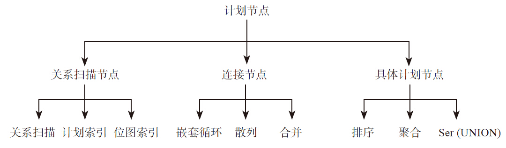
 
 
 现在，我们知道，计划器需要做相当多的决策，这些决策最终决定了执行时间以及资源消费（CPU、内存、磁盘I/O）。我们如何知道计划器将采取什么决定呢？我们可以用EXPLAIN命令来找出可能的（注意这是可能的）执行计划。使用EXPLAIN，我们只需要在我们要执行的SQL语句前加上EXPLAIN前缀，如下所示：

 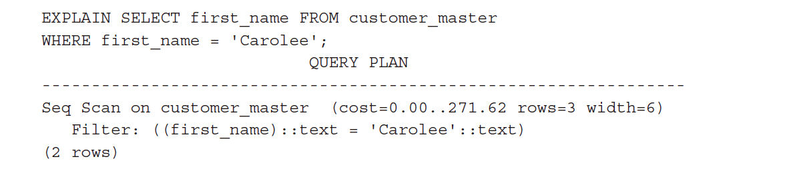
 
 查询计划的阅读顺序是从缩进最多的行读到缩进最少的行：从底到顶的顺序。包括cost/rows/width的每行是一个节点。Inner（child）节点流入outer（parent）节点。在前一个计划中，没有child节点。让我们看每一个字/数字，看看它意味着什么。
 
 第二行中的第一部分提到Filter，表明Filter被使用。这里还提到了数据类型。第一行的第一部分提到Seq Scan on customer_master。该表将以顺序的方式扫描并得到的相关记录。然后，这里有成本（cost）。成本是一个节点的影响程度的估计。它考虑一组变量（如页面读取和操作符的评价值），根据总的数据大小和被取出的行数进行计算。
 
 每个成本条目都有两个部分：启动成本和总成本。除非它真的是一个很重量级的查询，否则最内层节点的启动成本很可能是零或接近零。启动成本要做的工作是获取第一行。对于父节点，启动成本将接近子节点的总成本，这意味父节点的总成本将是子节点的总成本加上父节点自身的成本。
 
 下一个条目：rows是一个节点返回记录数的估计值。
 
 第三个条目：width是每个行的平均宽度（以字节为单位）。
 
 使用EXPLAIN提供的估计。如果我们添加ANALYZE，PostgreSQL执行这个查询，然后提供以下输出：
 
  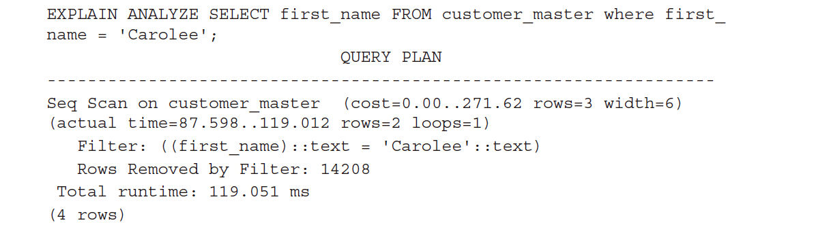
  
 现在有相当多的额外信息：actual time、rows、loops、Rows、Removed by Filter和Total runtime。这些项目本身是不需加以说明的。我们应该注意的是，估计和实际是否存在差异。例如，估计的行数值为3，实际却是2。如果估计和实际有很大的不同，我们也可以知道优化没有获取最新信息或优化的估计因为一些其他的原因而偏离。
 
 EXPLAIN其他两个有用的选项是FORMAT和BUFFERS。
 
 如果你连续两次执行相同的查询，你可能会找到那个Total_runtime明显下降。这是数据从缓冲区被读取产生的效果。如果我们使用的是缓冲选项，就可以看到这点。
 
 EXPLAIN的输出可以以不同的格式提供：TEXT、XML、JSON或YAML。让我们看看部分输出形式，并理解这两个选项：
  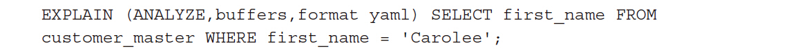
 当我们在数据库重新启动后执行这个查询，我们得到以下输出（只有几行显示）：
   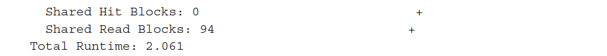
 第二次执行时，我们得到以下输出：
 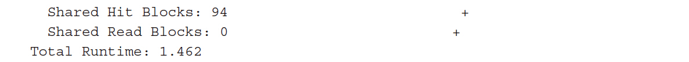
 差异是显而易见的：读写下来、命中上升和总运行时间下降，这意味着在缓冲区内可获得的数据是可用的。
 
 EXPLAIN可用选项的完整列表，请参考http://www.postgresql.org/docs/current/static/sql-explain.html 。

 EXPLAIN也可以用于UPDATE、DELETE和INSERT语句。使用时，为了避免数据更改，可使用如下语句：
  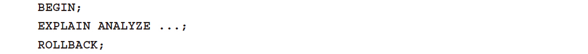
  
#### 优化指南

---
1 . 外键列索引 

当创建一个外键时，我们有一个父子关系表。例如，有一个订单头表和一个订单行表（针对订单头表中的每个条目，该表将有多个行对应）。子表通常有比父表有更多的记录。在子表中创建一个外键列索引总是不错的主意。

有两点原因，说明这样做是有用的。首先，我们总是使用这个列将父表与子表连接起来。当我们连接索引列时，创建索引可以提高性能。其次，当我们对父表记录进行更改时，例如删除记录，有这样一个索引可以提高删除语句的执行速度。通常，我们有一批作业，从生产表删除/清除记录，从而保持生产数据库的精益。外键列如果没有索引可能使这样的过程永远执行下去。

参阅下面的SELECT和DELETE实例。假设父表中每一条记录在子表中平均有4条记录。数据输出没有完全显示：
  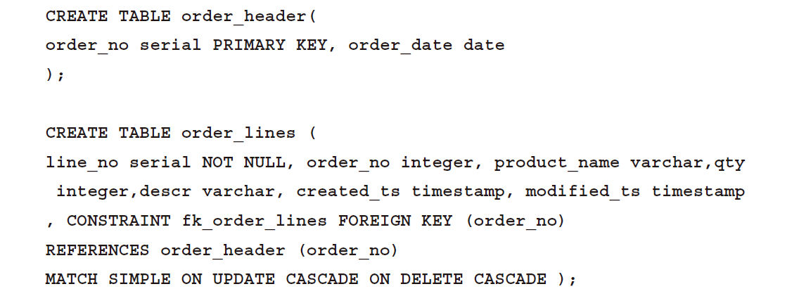
   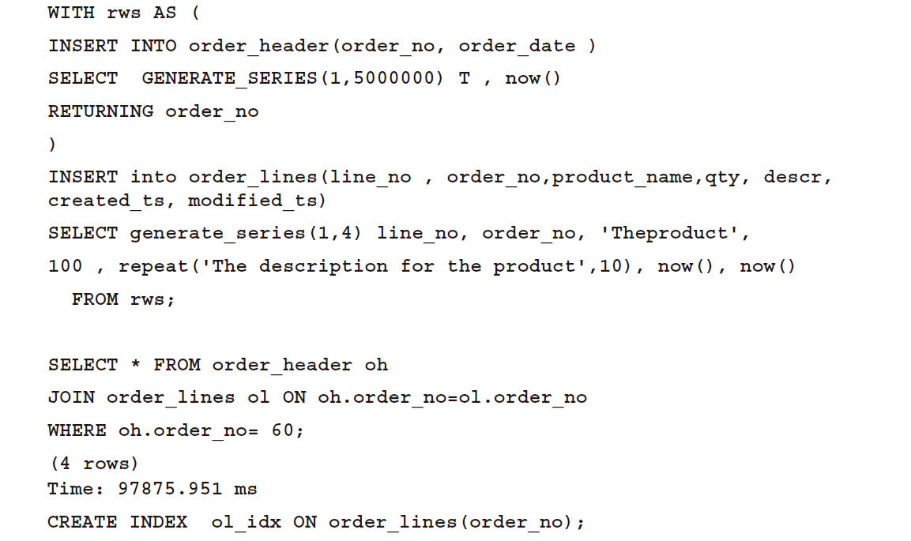
      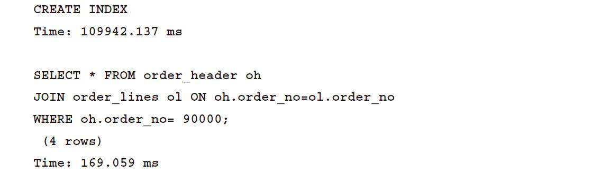
执行时间的下降是显而易见的。如果解释查询并查看创建索引之前和之后的输出，我们会看到区别。order_lines没有索引的情况下，该表会被顺序扫描。一旦我们增加了索引，这里改为了索引扫描。除此之外，其余的步骤基本相同。一旦索引到位，我们也将看到总成本和时间的明显下降。 

2 . 避免select *操作

   除非我们真的需要表中的所有列，否则不应该使用SELECT*。显示声明我们需要的列是一个好的编程实践；这样可以提高响应时间。看一下以下的例子。在两种情况下，索引都被使用。然而，一个例子中使用SELECT*，索引扫描之后是堆提取。在另外的例子中，PostgreSQL可以从索引中获取想要的数据，而不需要访问表。它的计划清楚地显示了使用的是仅索引扫描，如下图所示：
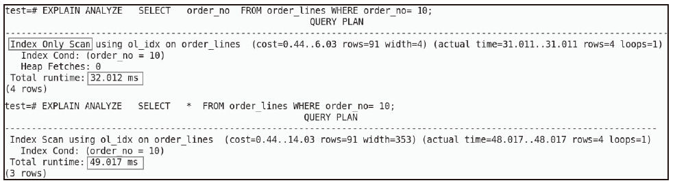

3 . order by 性能分析

有时输出的数据需要在一个或多个列上被排序。事务部分我们看到网上访问我们的银行账户的一个例子。数据通常使用交易日期列排序。然而，在某些情况下，数据不需要在任何特定的列上进行排序，我们搜索一个产品并显示结果的时候就是一个例子。看到的结果之后，用户可以决定按价格或受欢迎程度排序。当我们对SELECT*的结果排序时，整个被查询的数据集不得不被重排，不只是应用了排序的列。通常情况下，这种情况发生在内存中，而为了防止内存不够用，这将发生在磁盘上，从而造成巨大的性能损失。所以，我们不应该使用ORDER BY，除非我们不得不这样做。

如果不能避免ORDER BY，对ORDER BY的列使用索引可以减少排序的开销，因为将从索引中获取排好顺序的数据。

如果不指定索引类型，创建索引时，PostgreSQL将创建B-tree索引。索引条目是按照升序排列。我们可以通过指定DESC子句来改变排序顺序。

在本例中，last_name并没有索引。然而first_name有索引。在第一个查询中，我们在last_name上使用ORDER BY。正如预期的，PostgreSQL执行顺序扫描。在第二个例子中，PostgreSQL使用索引，虽然我们没有对任何列进行过滤：
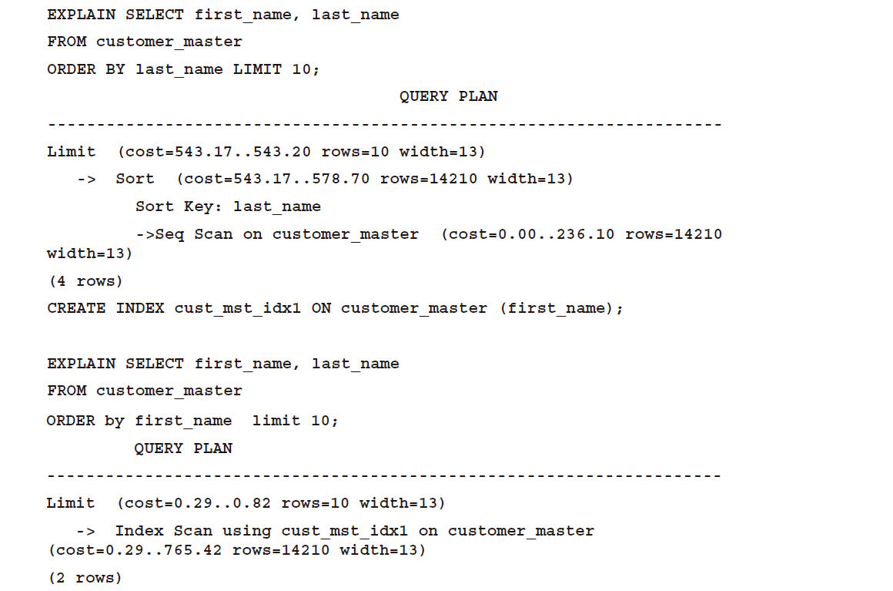

4 . 不在需要的地方滥用distinct 

有时我们无法确定使用的连接或者过滤条件的具体情况。所以我们添加DISTINCT来确保数据没有重复。然而，这个动作增加了不少开销。当在查询中添加DISTINCT时，实际执行显著增加，并且执行计划中有一个多出来的节点：
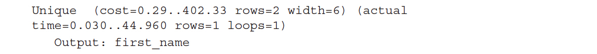
使用DISTINCT来避免重复仅仅隐藏了问题（连接不明确的问题）。正确的方法是检查是否以后重复并确保连接形式的正确。

5 .使用UNION ALL代替UNION
UNION在提取相关数据记录后执行一个去重操作。UNION ALL不会执行去重操作。通常，在不关心数据是否重复时，我们会漏掉ALL条件。然而这样会增加一些开销。

6 . 在过滤的条件下使用函数导致索引失效

第一种情况，当我们在某一列上使用函数进行过滤时，索引将不会被使用：
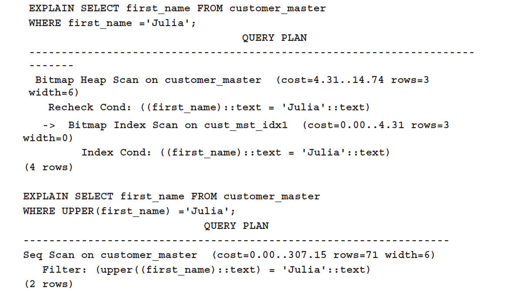
在第二种情况下，UPPER函数的使用阻止了索引的使用。有几个解决方法。第一种方法是确保数据总是使用大写的形式存储，在显示时候这样的转换已经不需要处理。在使用查询之前，该值将被转换为大写字母。另一种方法是使用基于表达式的索引。如下代码所示：
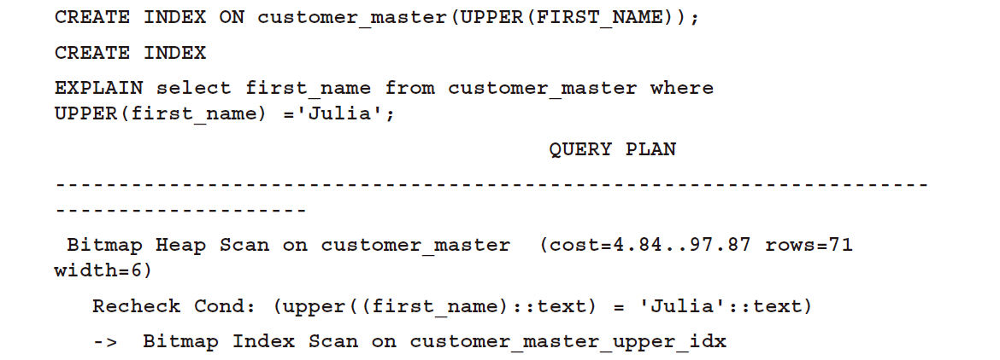
请注意，这是一个资源密集型的方法。函数会被多次执行，当我们创建索引（每个记录一次）时会执行，当该列被更新时也会执行。当我们将其应用于过滤器中的变量时，该函数也会被执行。

如果我们要区分大小写的文本，这个模块是值得一看的，参考http://www.postgresql.org/docs/current/static/citext.html 。

另一种情况是当我们在过滤子句中使用函数转换数据类型。在银行交易表的例子中，交易的时间通常会被捕获。当我们生成报告查看在特定的一天发生的所有交易时，查询（带有查询计划）可能会这样结束：
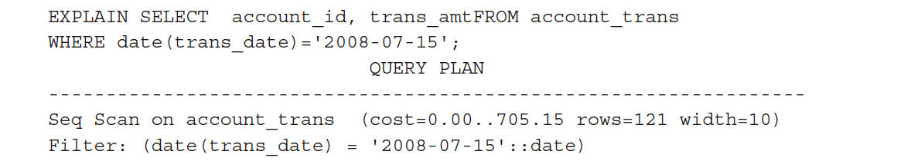
虽然trans_date列上面有索引，但是也不会被使用。这种情况下查询可能被重写为：
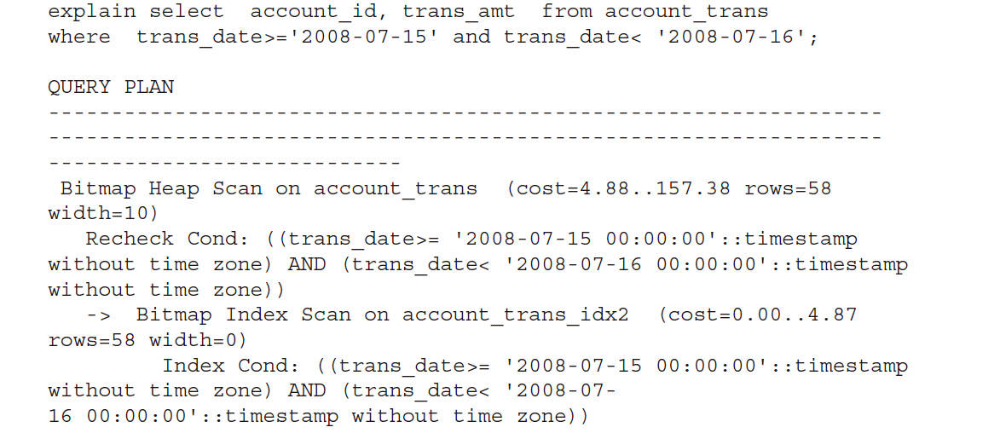
这里所做的是更改date（trans_date）='2008-07-15'为trans_date>='2008-07-15'和trans_date<'2008-07-16'。

通过重写脚本，我们避免了date()函数。把函数移开后，PostgreSQL则使用了索引。估计的开销值从705.15下降到157.38。

在前面所述的情况下，转换函数应用到了我们将要从表中提取的数据上。该查询的结果与表中的值是不一样的。例如，UPPER（'Julia'）和'Julia'不一样。B-树索引，默认创建的索引，是一种存储列值和并指向记录（包括了这些值的）的数据结构。在特定的情况下，当我们查询UPPER（'Julia'）时，索引表中的值为'Julia'并指向表中相应记录的位置。PostgreSQL不知道f（x）和x是一样的。所以，它决定不使用索引。

7 . 减少SQL语句

假设我们要生成一份银行交易报告。

该报告应将交易分为不同交易数量的群组，并告诉我们有多少交易的交易金额是从0到100的，有多少交易的金额从101到1000，等等。一种选择通过写多个SQL语句（使用不同的过滤条件）得到数据，如下所示：
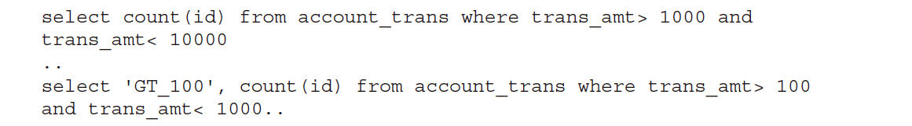
如果想把交易分成三个组别，我们最后用三个查询实现。虽然这种方法可以获取我们需要的数据，它扫描三次表，每个查询一次。我们可以通过以下代码来避免这种情况：
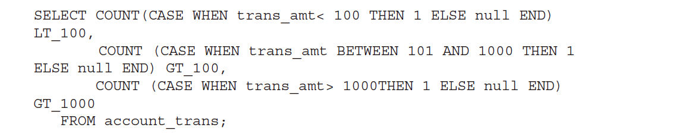
针对样本数据集的查询和执行计划的输出如下：
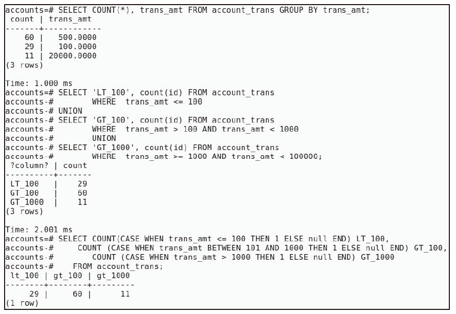
我们可以看到，在这两种情况下计数均被正确检索，如下图所示：
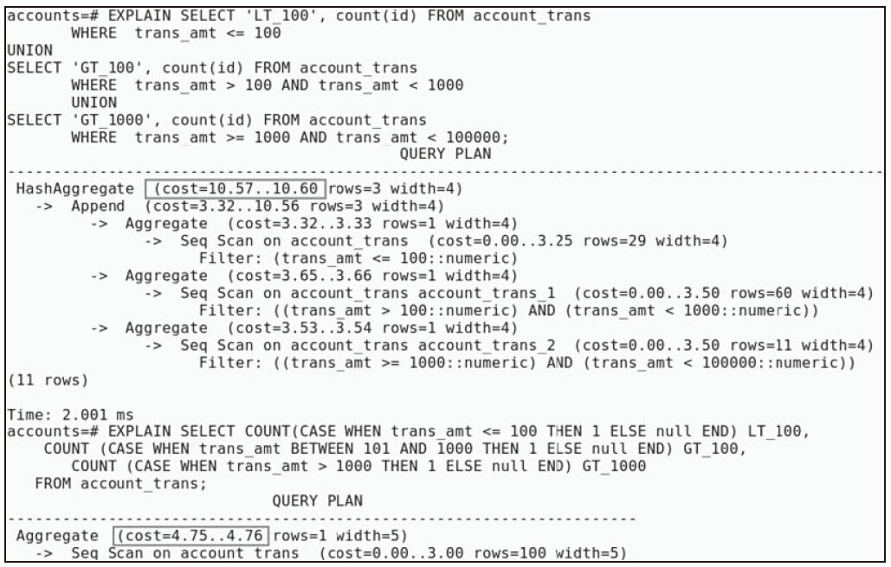
使用CASE结构的查询只扫描表一次，这样成本就下降了。

8 . 减少函数的执行 
我们经常使用用户定义函数或系统提供的函数比如date()。

虽然函数被尽可能优化过，但它们总是引入一定的开销。有时，可以通过重写查询来减少函数执行的数目。

首先，让我们启用函数跟踪。用于跟踪用户定义函数执行的设置被称为track_functions。它可以取值为none、pl或者all。我们将把它设置为all：
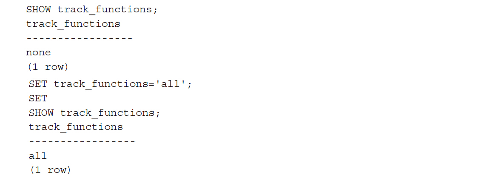
下一步，我们将创建一个函数，除了返回一个子字符串，它不做其他的事情。创建这个函数的主要目标是能够跟踪函数执行：
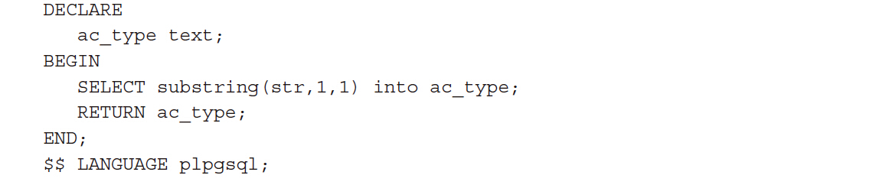
考虑一下我们从customer_accounts表和account_trans表中查询数据的场景，两表之间存在一个一对多的关系。我们在customer_accounts表的一列中应用函数。

让我们首先以最简单的方式编写查询：
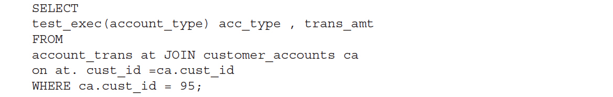
这个查询返回了11条记录，如下所示：

这个函数被执行了11次，让我们重写以上这个查询：
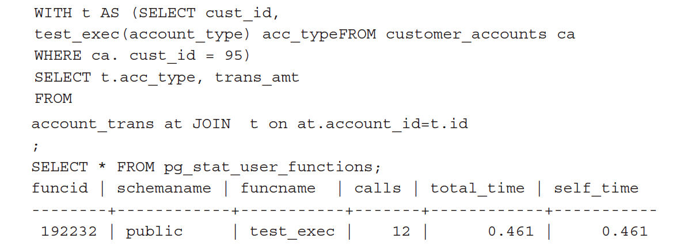
输出相同的11个记录，并且该函数仅被执行一次。当针对有数百或数千记录的结果集作用时，请考虑这些影响。

我们使用的WITH查询也被称为通用表表达式（Common Table Expression，CTE）。CTE允许我们编写命名的查询，这种查询用起来和表查询相似。可以说它们是临时表，而且仅仅在SQL语句执行期间存在。这是一个非常有用的功能，以至于使用PostgreSQL的每个人都应该知道。

此功能还可以让我们写递归查询。让我们看一个递归查询可能有用的场景。考虑一个表，它存储员工信息。每个员工都有一个记录。每个员工都有一个经理。员工经理的雇员ID存储在同一表的manager_id列。经理在manager_id列也有一个自己的数据记录。如果我们想看到所有员工直接或间接的报告关系（即，如果Scott报告给Smith，Smith报告给Adam，Scott间接向Adam报告）的员工，可以使用递归查询。递归查询可用于提取分层数据、遍历图等

PostgreSQL总是使用WITH完成对一个查询的物化处理。WITH字句是优化的围栏。我们在CTE中使用的过滤器不会被推到主查询，反之亦然。

9 . 索引失效情况 

虽然我们已经创建了一个索引列，但是在该列上使用过滤条件时，索引并不一定生效。PostgreSQL决定是否使用索引取决于结果集的可选择性，也就是散列程度。让我们讨论这两个概念。

散列程度是列中值的唯一性的一个指标。低散列程度意味着大量的重复值（用于存储性别的列是一个例子），高散列程度意味着有许多不同的值（以主键列为例）。如果一个字段的散列程度较低，可能发生的是，即使对该列应用等值过滤条件，表中大部分数据仍将会被检索。在这种情况下，相比于索引扫描后的随机读取，针对该表的顺序扫描可能是更有效的

示例如下：

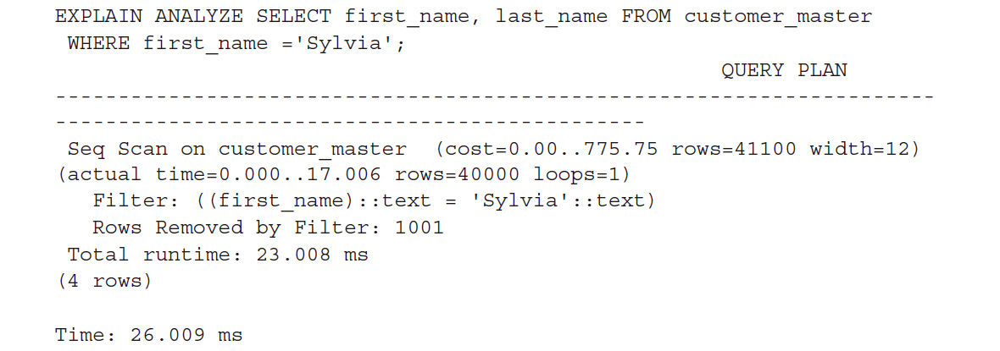
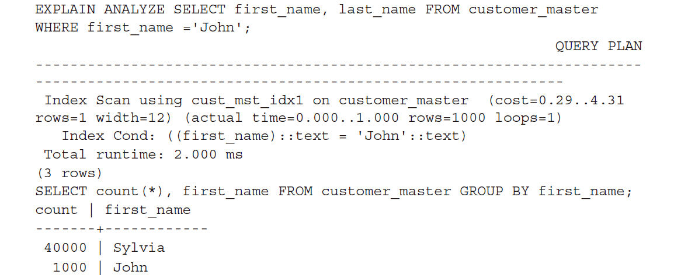
正如我们在这里看到的，这张表中的大多数人都是Sylvia。因此，使用索引进行匹配是个糟糕的选择。为什么呢？如果我们使用索引，PostgreSQL会执行大量的随机读取，这样的开销比读取整个中等大小的表还要多。

10 . 创建子集的索引

虽然在PostgreSQL中我们经常对所有记录创建索引，但是针对记录的子集创建索引也是可行的。例如：
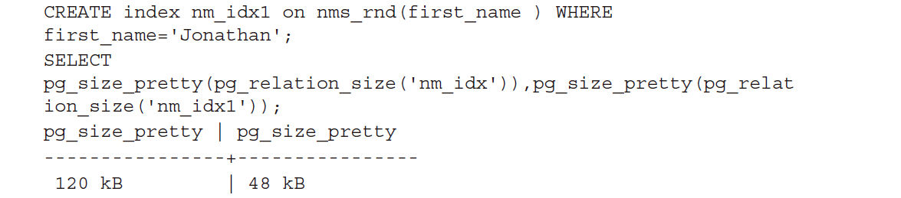
nm_index是不带任何过滤条件下创建的。在数据子集上创建索引的优势是可以比不用过滤条件创建的索引小。当索引被扫描时，结果就是性能会被提升。举例来说，考虑一个存储了大量需要被处理的记录的表，比如需要使用夜间批量作业发送的一些e-mail ID。这些需要被发送的e-mail记录会被标记为‘N’。而真正在处理的是标记为‘P’的记录。如果处理失败，记录会被标记为‘F’。一旦e-mail被发送，标记将被设置为‘Y’。几天之后，带有‘N’标记的记录将形成整个数据的一个小子集。大多数记录被设置为‘Y’。这个过程大多数情况是查询‘N’标记的记录进行处理。在标记为‘N’的记录上创建索引将比在整个数据集上创建索引更好。用于创建表和索引的SQL语句如下：
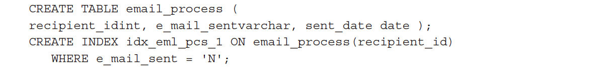
11 . 优化函数

PostgreSQL的函数可以选择一个不稳定性类别。类别的划分定义了函数的类型，规定了哪些是函数会做的或者哪些是函数不会做的。PostgreSQL制订执行计划时使用此信息；因此，不稳定性类别对查询（使用了某个函数）的性能产生影响。有三种可能的类别：

  - VOLATILE（不稳定） ：这些函数可以修改数据库，并在使用相同的参数进行连续调用时，返回不同的结果。如果需要返回该函数的结果，那么每一行都会运算一遍这个函数。
    
  - STABLE（稳定） ：这些函数不能修改数据库。对于查询返回的每一行，假设参数保持不变，它们将返回相同的结果。请注意，对于单一语句而言（而不是永远保持这样），结果必然是相同的。
    
  - IMMUTABLE（不可变） ：这些函数对于同样的参数将永远返回相同的结果。这是最严格的不稳定性类别。
  
为了达到更好的性能，我们应该使用最严格的不稳定性类别来定义函数。让我们修改我们之前使用的这个函数，并尝试使用VOLATILE和IMMUTABLE类别：
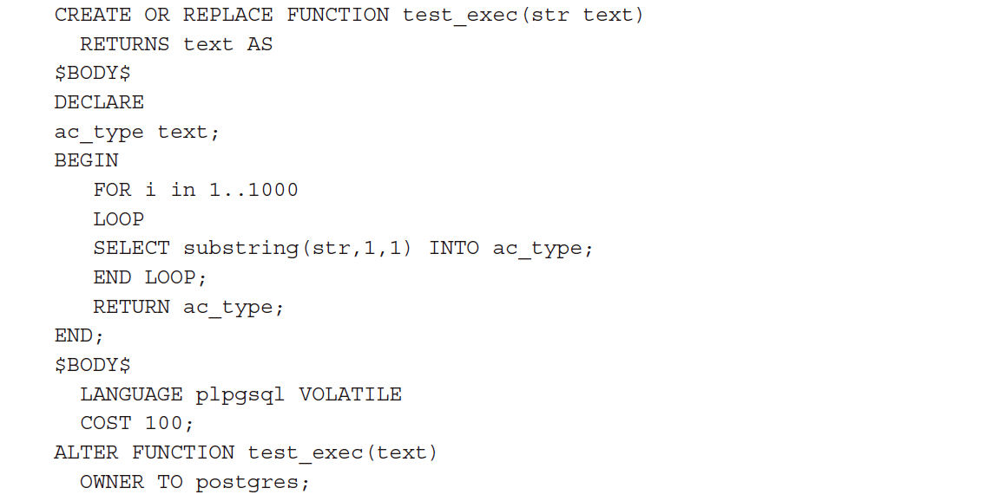

当创建函数时没有声明类别时，默认类别就是VOLATILE。我们启动track_functions，并在查询执行时跟踪耗时。

上面两次执行中间，函数类别从VOLATILE更改到IMMUTABLE。当函数类别从VOLATILE更改到IMMUTABLE后，执行耗时从30ms下降到10ms。函数执行次数的也随之下降。这并不意味着我们可以将所有的函数都定义为IMMUTABLE。如果我们添加一个UPDATE语句到这个函数中，并执行它，我们会得到如下错误提示：
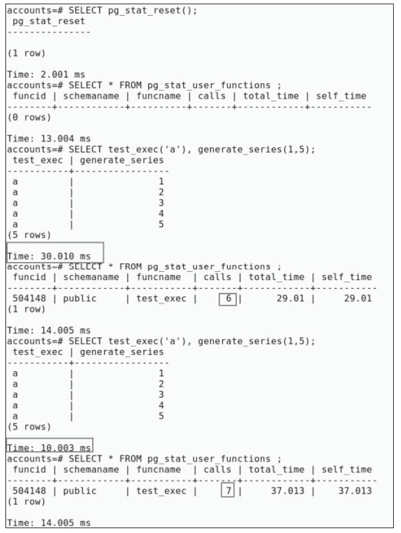

11 . 物化视图

物化视图与视图是相似的，因为它们都依赖于其他表的数据，虽然它们之间有一些差异。对视图的SELECT操作通常都会获取最新的数据，而对物化视图的SELECT操作可能会读取过期的数据。

另一个关键的区别是，物化视图包含实际的数据，并占用存储空间（一定比例的数据量），而视图并不占据明显的磁盘空间。

物化视图主要用于从基表中捕获数据的摘要或快照。一定的延迟/过期是可以接受的。考虑在营业日结束时，一家银行生成各个分支机构平均余额报表的情况。通常情况下，该报表将在当天业务结束后被发送，这意味着，这个平均值一旦计算出来，对于特定的一天是不大可能改变的。此外，可能没有人会要求在业务结束前看这份报表。

对于一个网站而言，在一天的不同时间显示平均和峰值流量的报表可能是另一个典型应用案例。

这里有一些物化视图的其他用例。让我们看一些其他的，可以使用PostgreSQL的外部数据包装器来访问来自不同数据源的数据：

·关系数据库（如Oracle和MySQL）

·NoSQL数据库（如MongoDB、Redis和CouchDB）

·各种类型的文件

对这些数据源的查询没有可预测的性能。我们可以基于这样的数据源创建外部表，并在这些外部表上创建物化视图。

我们使用物化视图存储预先计算的聚合有两个优点。第一个优点，我们避免了多次进行相同的计算产生的开销（很可能有多次对某个报表的请求，对不对？）。相对于基础表，提供摘要的物化视图往往是比较小的。因此，我们将节省扫描大表的成本。这是第二个优点。

当使用物化视图来存储来自外部表的数据时，可以使查询的性能更可预测。当多次访问外部表时，也消除了数据传输。

12 .分区表
我们看到，物化视图可以用来捕获摘要或预聚合的数据，而不是扫描大量大表的数据，除此之外，我们也可以扫描一个小表来获得我们想要的数据。

表分区将一个巨大的表分解成若干个小表，因此需要扫描更少的数据块即可检索需要的数据。当创建分区时，使用约束来确保只有特定的数据存储在一个分区上。

PostgreSQL的查询规划器可以使用这些约束从而避免扫描部分分区。此功能称为约束排除（检查表/分区的约束可以告诉PostgreSQL规划器，某个表/分区不会有指定的值。因此，该规划器可以避免扫描该表/分区）。

与单个大表的索引相比，分区上的索引将变得更小，这将增加它们纳入内存中的机会。我们还可以使用分区来实现一个分层存储。不经常访问的数据可以存放在慢磁盘的表空间的分区中，而那些经常访问的数据，放到快速磁盘的表空间的分区中，等等。

分区的另一个优点是便于维修。让我们考虑一个数据仓库的场景，随着时间的推移我们有很多年的数据，可以删除最早一年的数据。没有分区时，这涉及在一个DELETE语句中完成巨大数量记录的删除操作（这个操作是资源密集型的）以及由此产生的空白空间，随后是繁重的清空操作等。如果数据做了合理的分区，一个TRUNCATE语句就可以删除所有旧的数据。

创建分区表的步骤如下：

1.创建主表。这是子表的模板。此表不会真正拥有任何数据。

2.创建子表。这是一些存储数据的表。任何对主表的SQL操作将被转移到一个或多个可用的子表上。

3.创建一个触发器来实现SQL语句的重定向。
