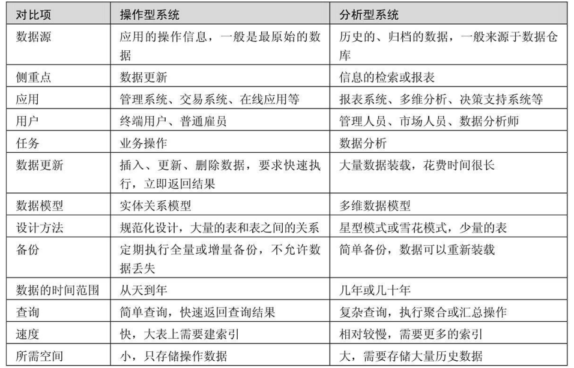
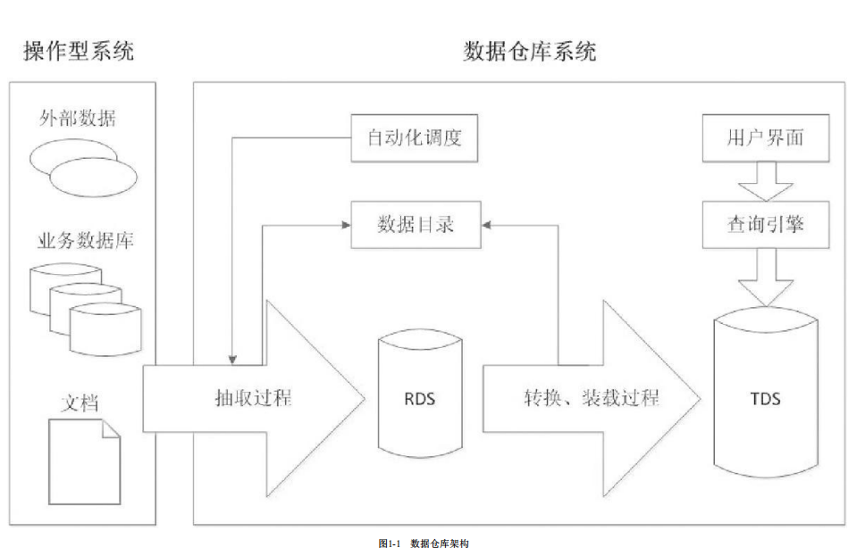
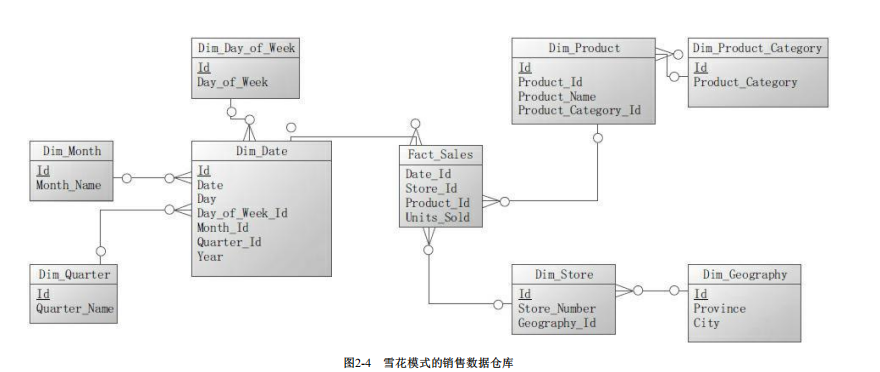
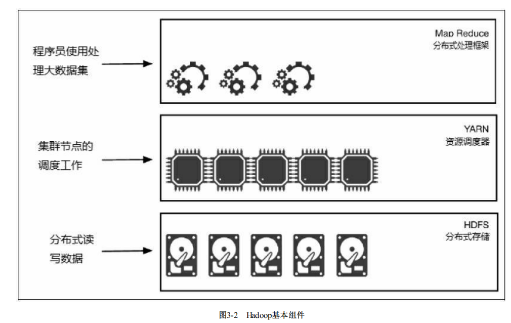
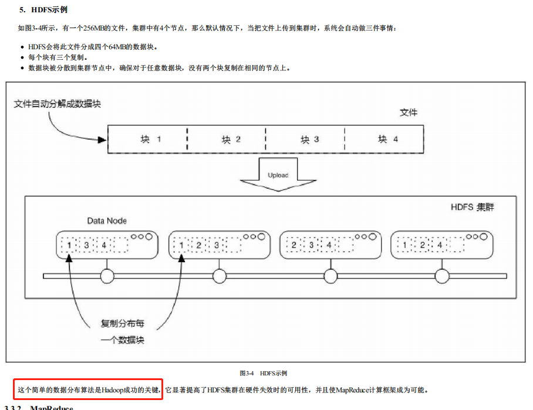
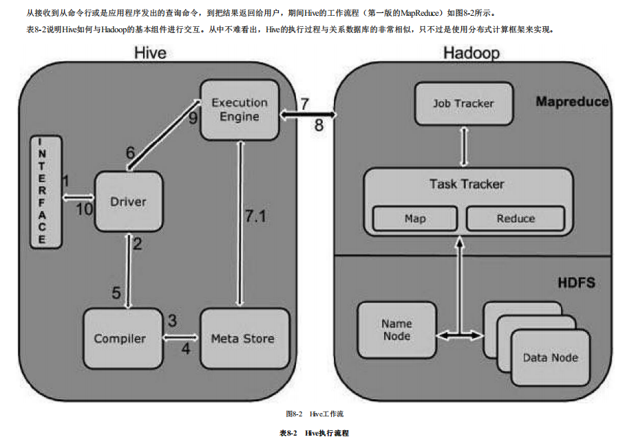

### 数据仓库的概念

#### 什么是数据仓库？

- 数据仓库描述为一个面向主题的、集成的、 随时间变化的、非易失的数据集合，用于支持管理者的决策过程。 
#### 为什么要构建数据仓库？

- 将多个数据源集成到单一数据存储，因此可以使用单一数据查询引擎展示数据。 （多数据来源汇总展示场景）
- 缓解在事务处理数据库上因执行大查询而产生的资源竞争问题。 维护历史数据。 （资源、性能限制）
- 通过对多个源系统的数据整合，使得在整个企业的角度存在统一的中心视图。   （大局观）
- 通过提供一致的编码和描述，减少或修正坏数据问题，提高数据质量。  （数据质量，支持决策）
- 一致性地表示组织信息。 （业务系统无法进行全局数据分析的工作）
- 提供所有数据的单一通用数据模型，而不用关心数据源。 （数据资产）
- 重构数据，使数据对业务用户更有意义。 （数据处理）
- 向复杂分析查询交付优秀的查询性能，同时不影响操作型系统。 开发决策型查询更简单。（性能）

#### 操作型跟分析型系统的区别

#### 数据仓库系统的架构

- 数据集市架构
- 从属数据集市架构
- Inmon企业信息工厂
- Kimball数据仓库架构（引擎采用）

#### 关系数据模型

- 星型模型

- 雪花模型

    雪花模型是当有一个或多个维表没有直接连接到事实表上，而是通过其他维表连接到事实表上时，其图解就像多个雪花连接在一起，故称雪花模型。

1. 优点：
 一些OLAP多维数据库建模工具专为雪花模型进行了优化。 
 规范化的维度属性节省存储空间。

2. 缺点：
雪花模型的主要缺点是维度属性规范化增加了查询的连接操作和复杂度。相对于平面化的单表维度，多表连接的查询性能会有所下降。但雪花模型的查询性能问题近
年来随着数据浏览工具的不断优化而得到缓解。 和具有更高规范化级别的事务型模式相比，雪花模式并不确保数据完整性。向雪花模式的表中装载数据时，一定要有严格的控制和管理，避免数据的异常插入或更 新。

- Data Vault模型

    Data Vault是面向细节的，可追踪历史的，一组有连接关系的规范化的表的集合。这些表可以支持一个或多个业务功能。它是一种综合了第三范式（3NF）和星型模型 优点的建模方法。其设计理念是要满足企业对灵活性、可扩展性、一致性和对需求的适应性要求，是一种专为企业级数据仓库量身定制的建模方式。

特点：
    一个设计良好的Data Vault模型应该具有以下特点： 
    所有数据都基于时间来存储，即使数据是低质量的，也不能在ETL过程中处理掉。 
    依赖越少越好。 
    和源系统越独立越好。 
    设计上适合变化。 
    源系统中数据的变化。 
    在不改变模型的情况下可扩展。
     ETL作业可以重复执行。 
     数据完全可追踪。
构成： 
    1.中心表     
    2.连接表
    3.附属表
### Hadoop
#### 大数据定义？
大、快、多、真

#### 什么是Hadoop?
    Hadoop是较早用来处理大数据集合的分布式存储计算基础架构，最早由Apache软件基金会开发。利用Hadoop，用户可以在不了解分布式底层细节的情况下，开发分布 式程序，充分利用集群的威力，执行高速运算和存储。简单地说，Hadoop是一个平台，在它之上可以更容易地开发和运行处理大规模数据的软件。 
#### Hadoop的构成
   基础模块：
1. Hadoop基础功能库：支持其他Hadoop模块的通用程序包。 
2. HDFS：一个分布式文件系统，能够以高吞吐量访问应用的数据。 
3. YARN：一个作业调度和资源管理框架。 
4. MapReduce：一个基于YARN的大数据并行处理程序。

#### HDFS示例

- 局限性
1. 块存储和命名空间高耦合 
    
    NameNode中的命名空间和块管理的结合使得这两层架构耦合在一起，难以让其他可能的NameNode实现方案直接使用块存储。 
2. NameNode不易扩展 
    
    HDFS的底层存储是可以水平扩展的（底层存储指的是DataNodes，当集群存储空间不够时，可简单地添加机器以进行水平扩展），但命名空间不可以。当前的命名空 间只能存放在单个NameNode上，而NameNode在内存中存储了整个分布式文件系统中的元数据信息，这限制了集群中数据块，文件和目录的数目。 
3. 性能 
    
    文件操作的性能受制于单个NameNode的吞吐量。 
4. 隔离性 
    
    现在大部分集群都是共享的，每天有来自不同部门的不同用户提交作业。单个NameNode难以提供隔离性，即：某个用户提交的负载很大的作业会减慢其他用户的作业 执行，单一的NameNode无法按照应用类别将不同作业分派到不同NameNode上。

#### MapReduce
 

#### Yarn
   YARN的基本思想是将资源管理和调度及监控功能从MapReduce分离出来，用独立的后台进程实现。这个想法需要有一个全局的资源管理器（ResourceManager），每个 应用还要有一个应用主管（ApplicationMaster）。应用可以是一个单独MapReduce作业，或者是一个作业的有向无环图（DAG）。

#### HIVE
 Hive是Hadoop生态圈的数据仓库软件，使用类似于SQL的语言读、写、管理分布式存储上的大数据集。它建立在Hadoop之上，具有以下功能和特点： 
1. 通过HiveQL方便地访问数据，适合执行ETL、报表查询、数据分析等数据仓库任务。 
2. 提供一种机制，给各种各样的数据格式添加结构。 直接访问HDFS的文件，或者访问如HBase的其他数据存储。
3. 可以通过MapReduce、Spark或Tez等多种计算框架执行查询。 
4. Hive提供标准的SQL功能，包括2003以后的标准和2011标准中的分析

  
  
### 维度表技术

角色扮演维度
层次维度
退化维度
杂项维度
维度合并
分段维度
。。
#### 事实表技术 